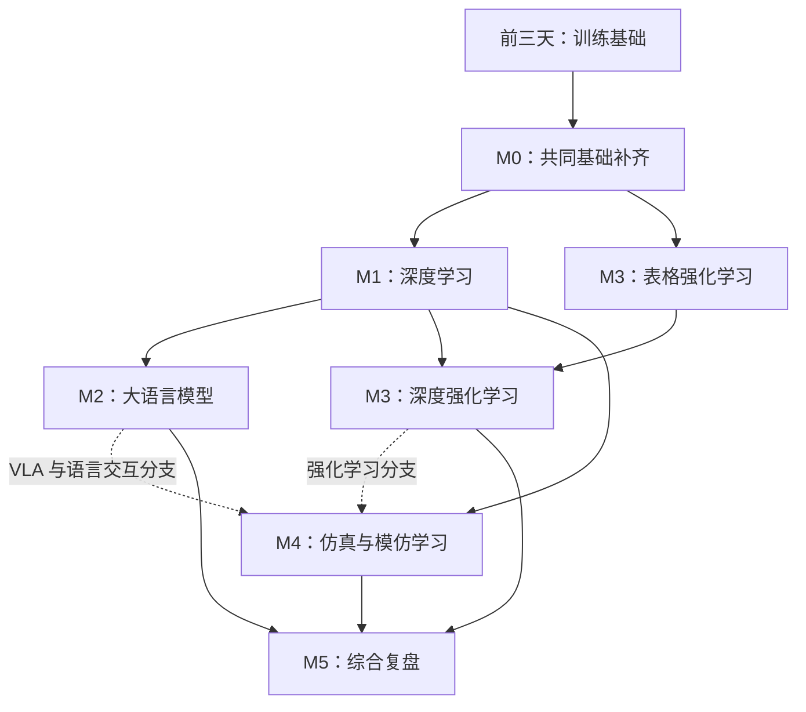

# 长期路线与范围

默认起点：能写 Python 函数和类，学过矩阵、求导和基础概率。目标是通读共同主干、完成代表性小实验、能脱离参考代码解释和改写；不按五个仓库的文件数量计算进度。时间为教学设计估计，先用前三天的实际学习速度校准。

## 五套材料如何去重

| 来源 | 在路线中的职责 | 不重复安排的内容 |
|---|---|---|
| [D2L](https://github.com/d2l-ai/d2l-zh) | M0/M1 主线，连接公式、代码与实验 | 数学和 PyTorch 按掌握程度补，不整本从头抄代码 |
| [吴恩达深度学习笔记](https://github.com/fengdu78/deeplearning_ai_books) | M1 的优化、正则化、误差分析和项目组织 | 反传、CNN、RNN 与 D2L 合并；它不替代传统 ML 全景 |
| [Happy-LLM](https://github.com/datawhalechina/happy-llm) | M2 的 tokenizer、预训练、SFT/LoRA、评估与应用 | Transformer 机制在 M1 学一次；M2 重点转向语言建模目标和数据 |
| [Easy-RL](https://github.com/datawhalechina/easy-rl) | M3 的 MDP、价值函数、策略与交互采样 | PyTorch、优化器和神经网络沿用 M0/M1；表格 RL 可提前学 |
| [Embodied-AI-Guide](https://github.com/TianxingChen/Embodied-AI-Guide) | M4 的领域地图与一个仿真操作任务 | 视觉/策略网络复用前面能力；机器人学、仿真与控制概念单独补 |

用户提供的 Easy-RL 链接是第 1 章问答与关键词，课程按整个项目的核心章节安排。具身指南是大型资源索引，不能把它的全部外链当作一门短课。版本与访问范围见 [资料页](RESOURCES.md) 和 [来源锁定](../references/sources.lock.json)。

## 先后依赖

线性执行时采用 M0 → M1 → M2 → M3 → M4 → M5，减少频繁切换环境。表格 RL 可以提前；具身模仿学习入门无需先把所有 LLM/RL 学完。Happy-LLM 第 8 章涉及 RL 后训练，放在 M3 后作为扩展。

## 时间和完成边界

| 模块 | 时间 | 核心交付 |
|---|---:|---|
| [M0](../modules/00-foundations.md) | 20–30h | 梯度推导、传统模型比较、无泄漏评估 |
| [M1](../modules/01-deep-learning.md) | 50–70h | 分类/序列/注意力实验、训练诊断与一次对照 |
| [M2](../modules/02-llm.md) | 35–50h | 小语言模型、一次轻量微调、固定问题集评估 |
| [M3](../modules/03-reinforcement-learning.md) | 35–50h | 小型 MDP、Q-learning、一个深度 RL 任务 |
| [M4](../modules/04-embodied-ai.md) | 35–55h | 一个仿真操作任务的数据→训练→评估流程 |
| [M5](../modules/05-integration.md) | 15–25h | 一个小项目和跨领域机制对照 |

合计 190–280 小时，预留弹性后按 **200–300 小时**规划，中值约 250 小时。每天 4–5 小时约 40–75 个学习日，中值约 50–63 天；这不是 3–5 天能完成的总课程。如果 Python、线代或概率需要从零补，时间另计。

前三天 13.5 小时计入 M0/M1。后续 `day04` / `day05` 是原有专题入口，不意味着整个模块只需要一天。每个模块内的时间是指导分配，复杂环境排错可能超出预留；完成一轮后根据日志修订。

## 一次学习如何结束

每次只推进一个明确问题：输入和输出是什么 → 为什么这样建模 → 核心式子怎样推到代码 → 预测改动的结果 → 做实验核对 → 说明结果的适用范围。每天最后关闭资料，用自己的话讲 5–10 分钟。

进度分成读过、跑过、改过、讲得清。完成一个模块需要自己的推导/实现、可追溯实验记录和能解释失败的复述；准备好的脚本和助手的检查不替代个人完成。新模块目前只完成设计，实际环境和实验需在开始该模块时建设与验证。

## 留到第二轮

完整教材所有习题、现代 CNN 架构逐一重训、大规模预训练、多卡调优、完整 RL 算法全集、真实机器人部署，以及具身指南全部外链。苏剑林博客按当前问题选读，不能把浏览一遍目录算作掌握数学推导。
